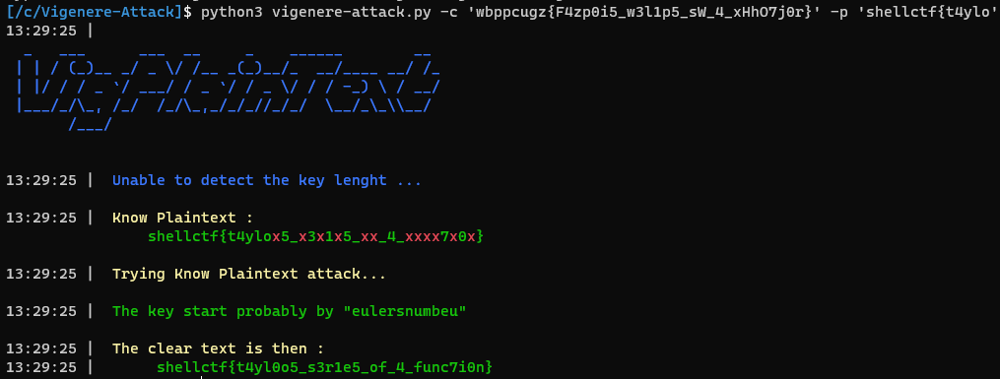

# Vignère-Plaintext-Attack
This tool automates a plaintext attack on a vigenere cryptosystem

## Help

```
[/c/Vigenere-Attack]$ python3 vigenere-attack.py -h
usage: vigenere-attack.py [-h] [-p PLAINTEXT] -c CIPHER [-f FORMAT] [-q]

This tool automates a plaintext attack on a vigenere cryptosystem

optional arguments:
  -h, --help    show this help message and exit
  -p PLAINTEXT  Know Plaintext
  -c CIPHER     Ciphered text
  -f FORMAT     Format Flag
  -q            Quiet mode
  ```
  
 ## Example 
 (*During ShellCTF 2022*)
 
